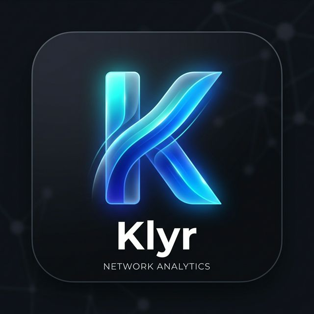

# Klyr

<div align="center">
	
</div>

Klyr is a modern digital identity wallet that helps users manage, verify, and share credentials through a mobile-first web experience.

This repository is a monorepo containing:
- A Next.js frontend (`frontend/`) with App Router and Tailwind CSS.
- An Express + Prisma backend (`backend/`) for dashboard and credential data.

## Table of Contents

- [Overview](#overview)
- [Core Features](#core-features)
- [Tech Stack](#tech-stack)
- [Repository Structure](#repository-structure)
- [Getting Started](#getting-started)
- [Environment Variables](#environment-variables)
- [API Endpoints](#api-endpoints)
- [Available Scripts](#available-scripts)
- [Deployment](#deployment)
- [Troubleshooting](#troubleshooting)
- [About Me](#about-me)

## Overview

Klyr demonstrates an identity-first product flow where users can:
- Sign in and view trust metrics.
- Browse and filter credentials in a secure vault.
- Simulate document upload and verification states.
- Generate share sessions for selective data sharing.
- Explore a timeline of verified life and career events.
- View AI-assisted opportunities and identity insights.

The current frontend is configured to use a mock API client (`frontend/src/lib/api.ts`) so the app can run without backend dependency during UI development.

## Core Features

- Authentication UI with mock login flow.
- Dashboard with trust score, verification summary, and recent activity.
- Credential Vault with category filtering (Education, Employment, Identity, Finance, Health).
- Timeline view for chronological identity milestones.
- Share Hub with document selection and one-time QR sharing simulation.
- Scan flow with simulated QR verification result.
- Profile area with account summary and quick actions.
- PWA installation prompt support via `beforeinstallprompt`.

## Tech Stack

Frontend:
- Next.js 16 (App Router)
- React 19
- TypeScript
- Tailwind CSS 4
- Axios
- Lucide React

Backend:
- Node.js + Express
- Prisma ORM
- SQLite (default local datasource)
- CORS + dotenv

## Repository Structure

```text
Klyr-main/
|-- README.md
|-- backend/
|   |-- index.js
|   |-- package.json
|   |-- prisma.config.ts
|   |-- vercel.json
|   |-- prisma/
|   |   |-- schema.prisma
|   |   `-- seed.js
|   `-- test-prisma.js
`-- frontend/
		|-- package.json
		|-- next.config.ts
		|-- public/
		|   `-- manifest.json
		`-- src/
				|-- app/
				|-- components/
				`-- lib/
```

## Getting Started

### Prerequisites

- Node.js 18+
- npm 9+

### 1) Clone and Install

Install frontend dependencies:

```bash
cd frontend
npm install
```

Install backend dependencies:

```bash
cd ../backend
npm install
```

### 2) Run Frontend (Mock API Mode)

This is the fastest way to run the project and is enough for most UI/product flows.

```bash
cd frontend
npm run dev
```

Open http://localhost:3000

Default mock login credentials:
- Email: `test@example.com`
- Password: `123456`

### 3) Run Full Stack (Frontend + Backend + Prisma)

Backend setup:

```bash
cd backend
npx prisma generate
npx prisma db push
npx prisma db seed
npm run dev
```

The backend starts on http://localhost:5000 by default.

Note: The frontend currently imports a mock client from `frontend/src/lib/api.ts`. To use live backend calls from the UI, replace the mock implementation with an Axios instance pointing to your backend URL.

## Environment Variables

Create `backend/.env`:

```env
PORT=5000
DATABASE_URL="file:./dev.db"
```

Notes:
- `PORT` is optional (defaults to `5000`).
- `DATABASE_URL` is used by Prisma via `prisma.config.ts`.

## API Endpoints

Base URL: `http://localhost:5000`

- `GET /health` - Service health and timestamp.
- `GET /dashboard-data` - First user profile for dashboard.
- `GET /credentials` - All credentials.
- `GET /credentials?type=Education` - Filtered credentials by type.
- `GET /activities` - Recent activity list.

## Available Scripts

### Frontend (`frontend/package.json`)

- `npm run dev` - Start Next.js dev server.
- `npm run build` - Build production bundle.
- `npm run start` - Start production server.
- `npm run lint` - Run ESLint.

### Backend (`backend/package.json`)

- `npm run dev` - Start backend with nodemon.
- `npm run start` - Start backend with Node.
- `npm run postinstall` - Generate Prisma client.

## Deployment

### Frontend

Deploy `frontend/` as a standard Next.js app (Vercel recommended).

### Backend

`backend/vercel.json` is configured to deploy `index.js` as a Node serverless function on Vercel.

Before deploying backend, ensure:
- Prisma client is generated during build.
- Datasource is configured for your deployment environment.
- CORS allowlist in `backend/index.js` includes your frontend domain.

## Troubleshooting

- Prisma client errors:
	- Run `npx prisma generate` in `backend/`.
- Empty backend data:
	- Run `npx prisma db seed` in `backend/`.
- CORS issues in production:
	- Update `allowedOrigins` in `backend/index.js`.
- Frontend not using backend:
	- Verify `frontend/src/lib/api.ts` is not in mock mode.

## About Me

<div align="center">

<!-- HEADER BANNER -->


<!-- TYPING ANIMATION -->


<!-- CONTACT BADGES -->
<p>
	<a href="https://linkedin.com/in/aadityaaaaa">
		
	</a>
	<a href="https://github.com/aad1tyaaaaa">
		
	</a>
	<a href="mailto:aadityaaaaa.jaiswar@gmail.com">
		
	</a>
	<a href="https://www.youtube.com/@aad1tyaaaaa">
		
	</a>
	<a href="https://www.kaggle.com/aadityajaiswar">
		
	</a>
	<a href="tel:+917710024884">
		
	</a>
</p>


</div>

---
